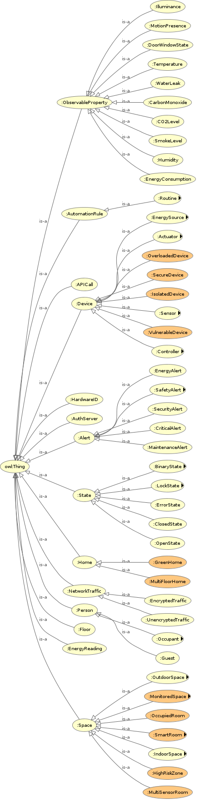

# Smart Home IOT Ontology

This project was developed as a practical assignment for the Knowledge Representation course at the University of Verona.

## Course Information
Full details regarding this academic course can be found at the following link:
[University of Verona - Course Details](https://www.corsi.univr.it/?ent=cs&id=1355&menu=studiare&tab=insegnamenti&aa=2025/2026&codiceCs=S84R&codins=4S010676&discr=&discrCd=)

## Graphical Visualization
The class hierarchy of this ontology was generated using OWLViz in Protégé. Orange nodes are defined (complex) classes; yellow nodes are primitive classes.

## Technologies Used
* **OWL 2.0**: For defining the ontology structure and logic.
* **Protégé**: As the primary Integrated Development Environment (IDE).
* **OWLViz**: For the visual representation of the class hierarchy.
